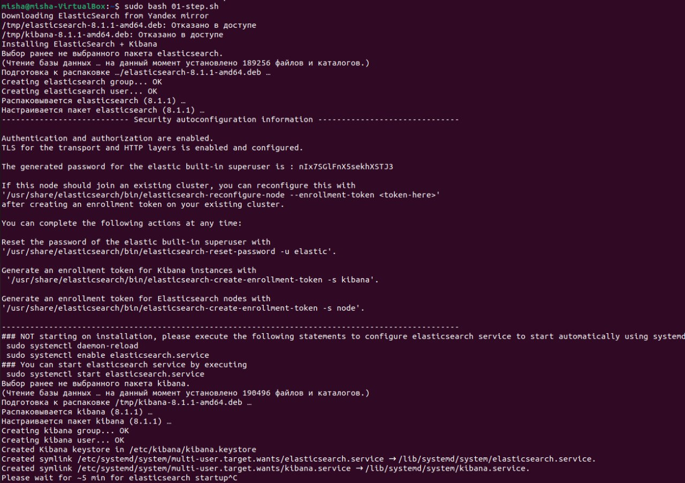
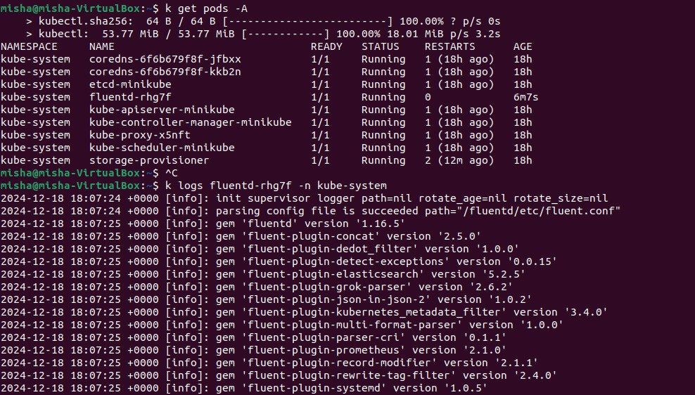
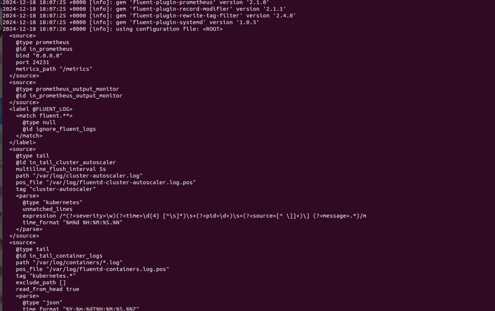
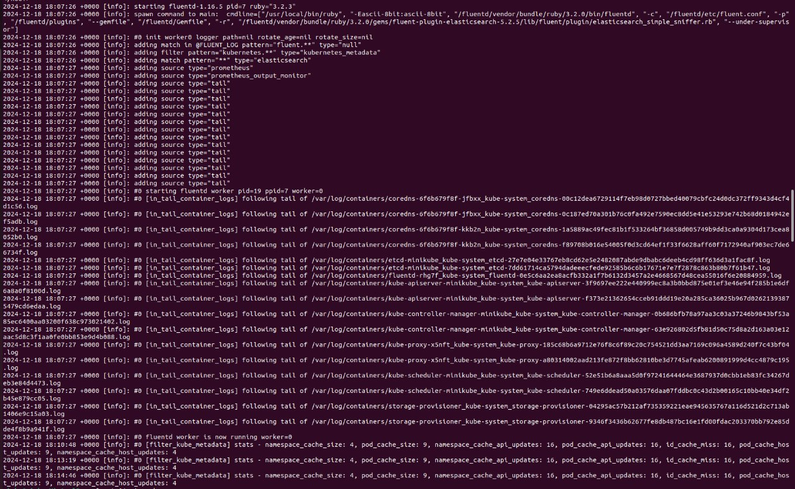
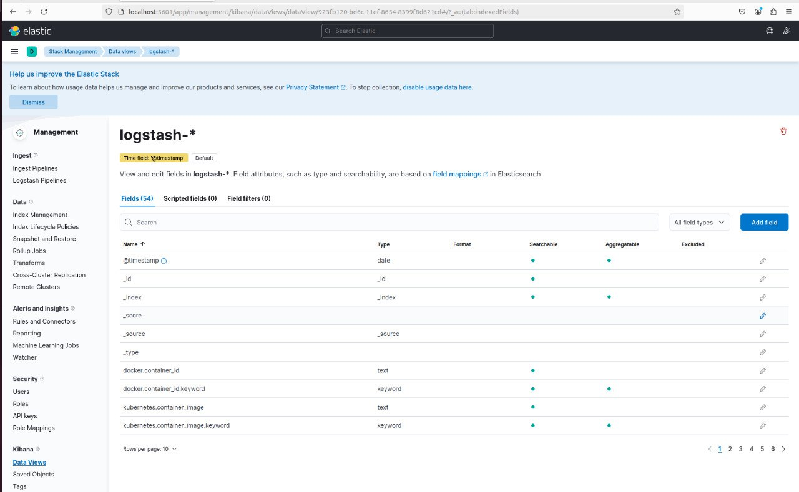
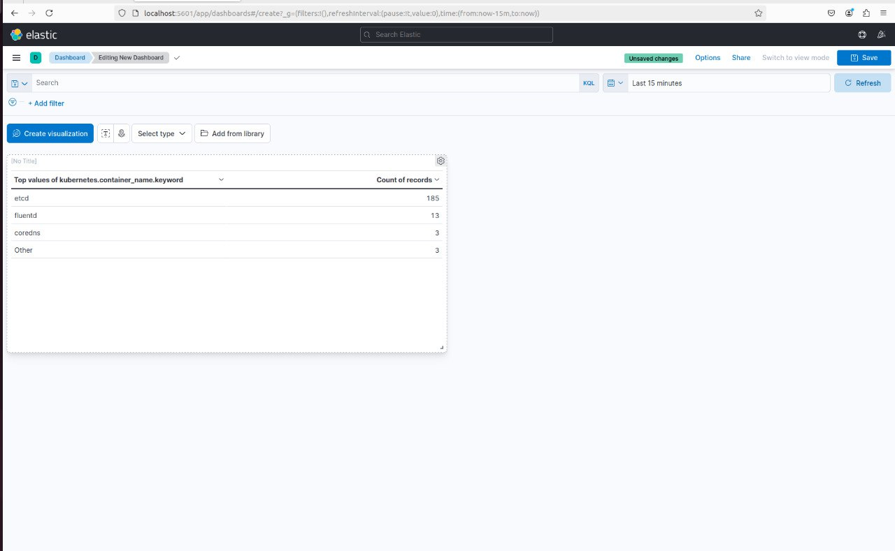

# HW 4. Elasticsearch & Kibana

## Фотоотчет

### Запуск команд в терминале

Сначала запустил скрипт без sudo, но пара команд скипнулась из-за отсутсвия прав рута. С sudo все норм было, но на команде restart elasticsearch почему-то скрипт завис, поэтому я его прервал и вручную отдельно запустил systemctl restart elasticsearch и systemctl restart kibana. Затем запустил манифест

Работаю на своей виртуалке, поэтому поменял в alias`ах ubuntu на misha и добавил в /home/misha/.bashrc

Вывел поды. Под с fluentd назывался fluentd-rhg7f. Вывел его логи

Потом в логах был большой конфигурационный файл (не стал его целиком вставлять)

А после файла вывело следующее:

### Работа в UI

В моем случае UI был доступен на localhost. Создал DataView:

А затем сделал дашборд с названиями контейнеров и количество записей по контейнеру.

