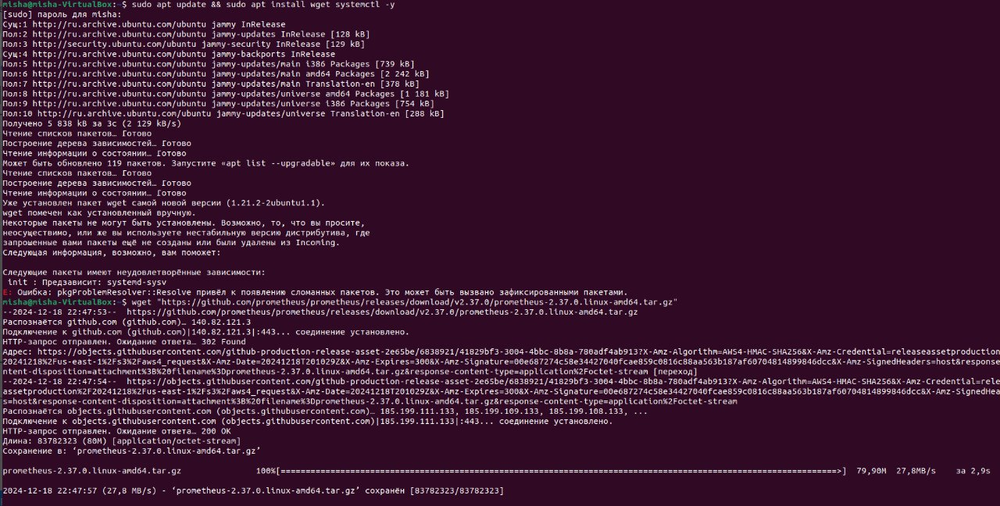
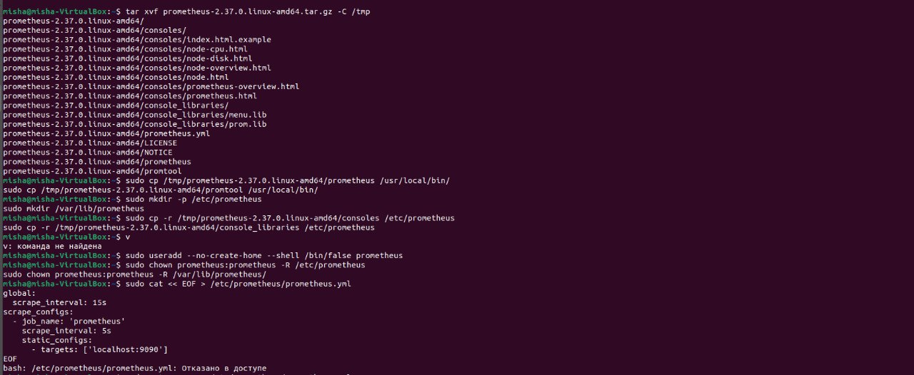
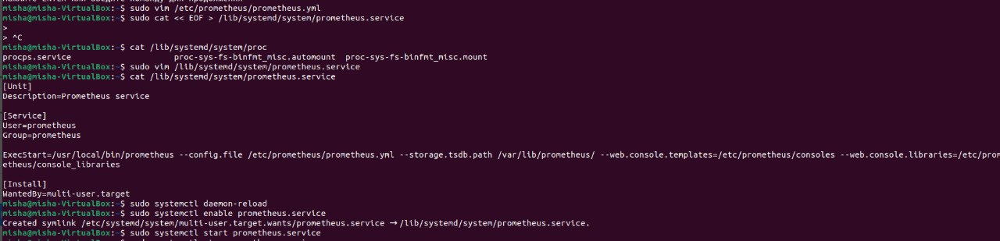
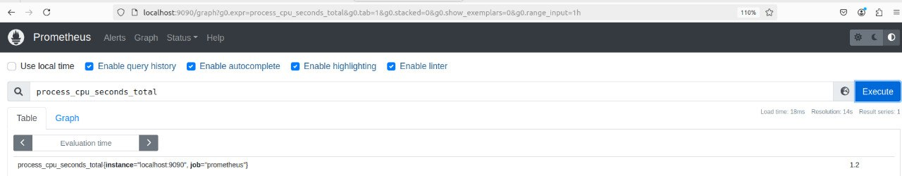
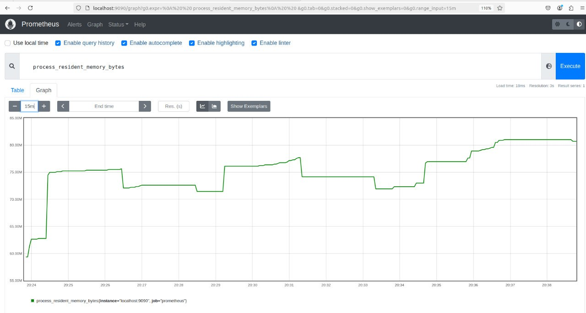
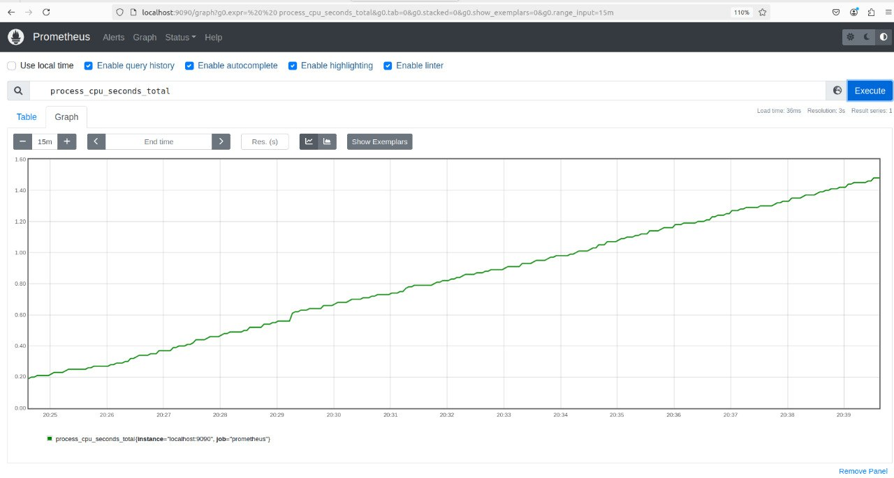

# HW 5. Prometheus

## Фотоотчет

### Часть 1

#### Установка Prometheus

Проблем с установкой не было. Скрины из терминала:

#### Метрики в UI

Prometheus UI стал доступен по адресу localhost:9090. Вот примеры метрик:

### Часть 2

Если вкратце, то оно не завелось. Я добавил установку prometheus-client в dockerfile (RUN pip install prometheus-client и в venv тоже добавил) и сделал EXPOSE 8000. Добавил в config.yaml (из репозитория) metrics: prometheus и добавл блок, в котором указывал порт 8000. Также пытался хардкодить port 8000 в файле prometheus.py. Пробросил порт service.yaml(блок с targetPort: 8000) и deployment.yaml (- containerPort: 8000). В ingress перед путем-регуляркой путь до / с портом 8000. Очень долго пытался подебагать, но не завелось на уровне пода.

Что добавить в prometheus.yml вроде понятно: заменил таргет на localhost:8000. Но не смог проверить, потому что прошлый этап не завелся.

Еще возникли проблемы с логами подов в деплойменте: kubectl logs <pod-name> выводил только принты из entrypoint.py, хотя приложение работало (как минимум на порту 8080). Так и не нашел реальных логов.

Все измененные файлы приложил (config.yaml не целиком, а только начало, в котором все изменения). 

