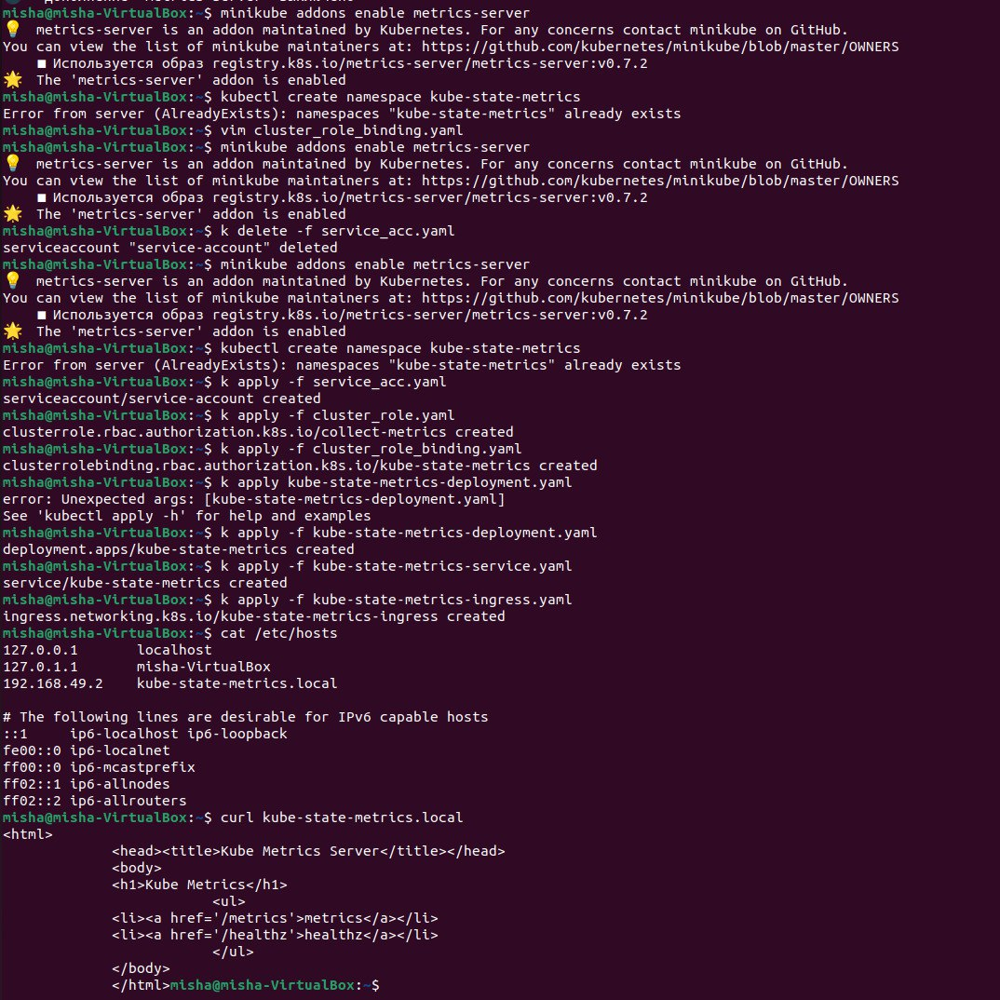
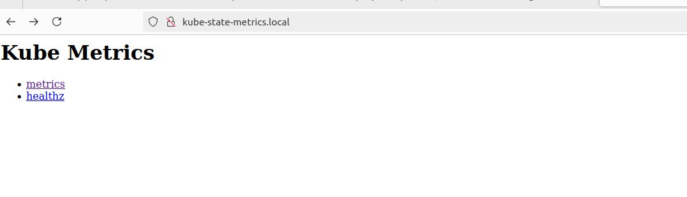
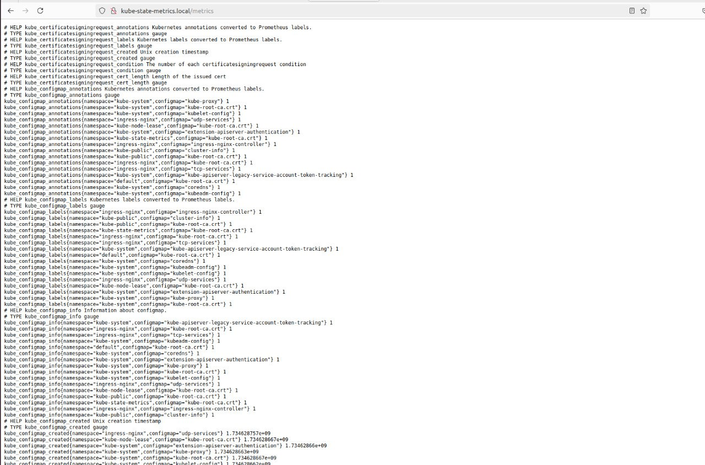
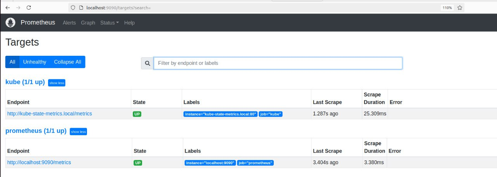
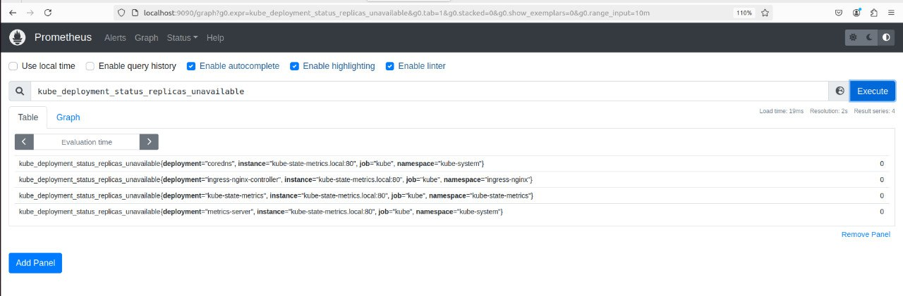
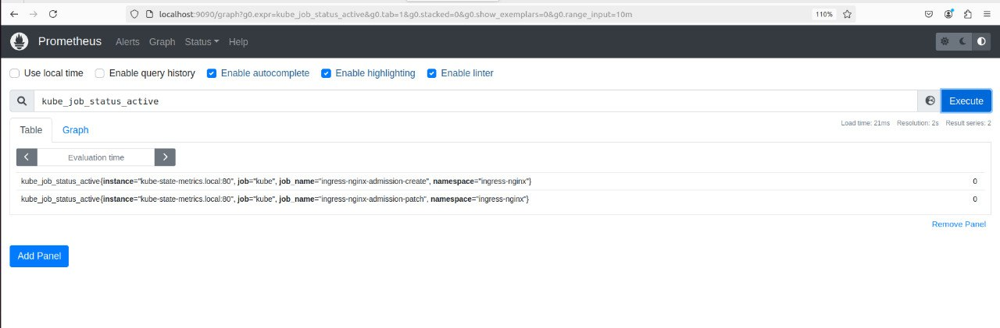

# HW 6. Метрики k8s

## Фотоотчет

### Часть 1

Просто следуя инструкции из первой части у меня алерты не собирались метрики, потому что у пода в deployment не хватало прав. Поэтому я добавил манифесты service_acc.yaml, cluster_role.yaml и cluster_role_binding.yaml (они лежат рядом в этой папке), а также добавил строку "serviceAccountName: service-account" в файл deployment. Если вкратце, то я при помощи ServiceAccount связал deployment с ClusterRole, которая дает доступы get, list, watch ко всем типам ресурсов во всех API-группах.



После этого по адресу kube-state-metrics.local стал доступен какой-то UI, а в metrics были реальные метрики, а не только их описание:



### Часть 2

Добавил в prometheus.yml блок для kube. Теперь он выглядит вот так:
```
global:
  scrape_interval: 15s
scrape_configs:
  - job_name: 'prometheus'
    scrape_interval: 5s
    static_configs:
      - targets: ['localhost:9090']
  - job_name: 'kube'
    scrape_interval: 5s
    static_configs:
      - targets: ['kube-state-metrics.local']
```
И перезапустил prometheus.service

В UI проверил, что появился новый таргет:



А дальше пошел смотреть метрики. Самыми полезными мне показались следующие:

1) kube_deployment_status_replicas_unavailable. Считает количество недоступных реплик в деплоймент. По этой метрике очень легко понять, что что-то не так: если она не 0, то что-то сломалось.



2) kube_job_status_active. Показывает кол-во активных джобов. Думаю, на это стоит обращать внимание перед тем, как выкатывать новую версию приложения, чтобы случайно не оставить приложение в неконсистентном состоянии.



3) kube_pod_container_restarts_total. Показывает количество рестартов контейнера внутри пода. Понятно, что если это кол-во резко начало расти, то у нас явно есть какие-то проблемы со стабильностью.

