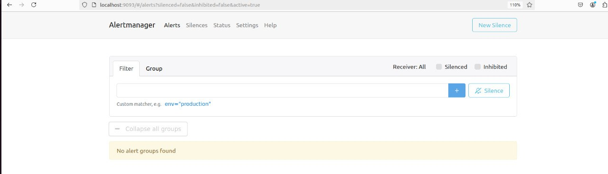
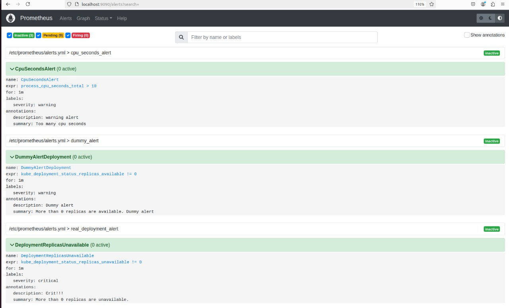
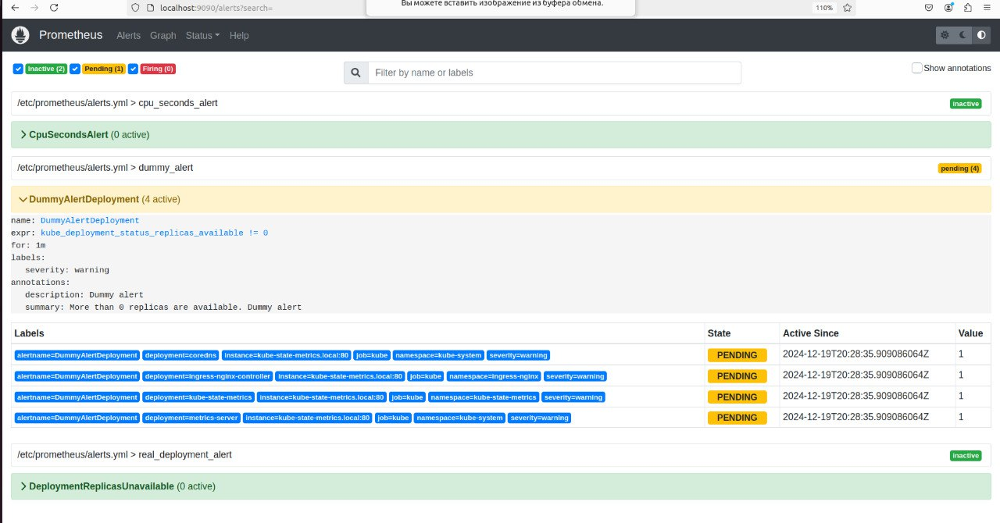
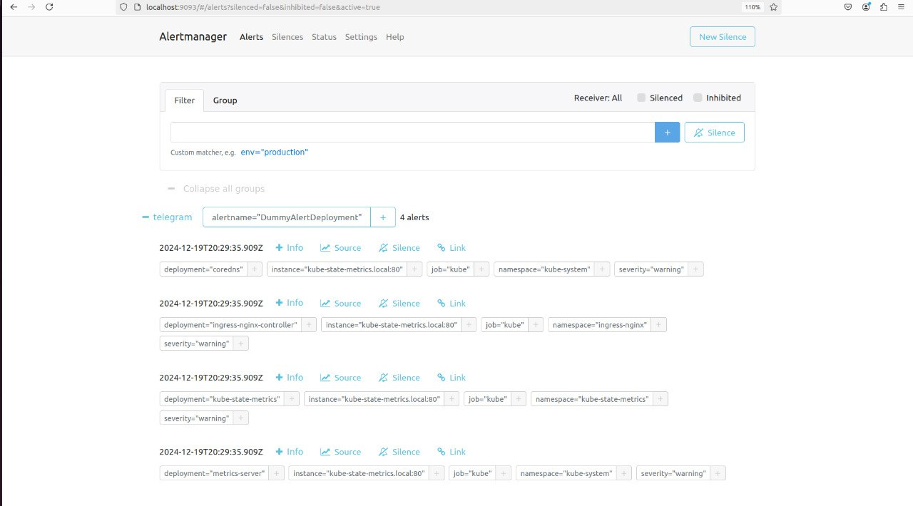
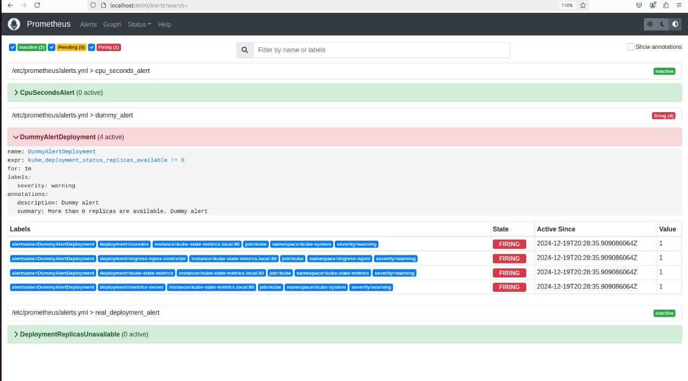
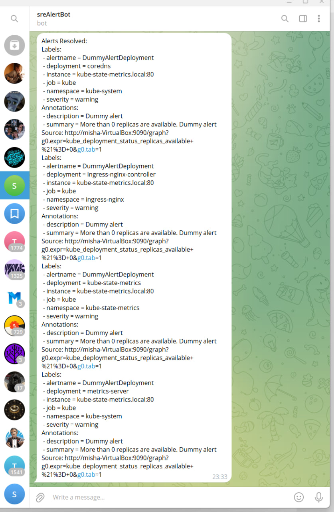

# HW9 Alerting

## Фотоотчет

### Часть 1


#### Поднятие Alertmanager

ВСЕ УПОМЯНУТЫЕ ФАЙЛЫ ЛЕЖАТ РЯДОМ С РИДМИ

Сначала я спуллил image alertmanager. Дальше написал файл alertmanager.yml, в котором настроил отправку алертов ботом мне в личку.
Дальше запустил alertmanager
```
docker run -d --name=alertmanager -p 9093:9093 -v $(pwd)/alertmanager.yml:/etc/alertmanager/alertmanager.yml prom/alertmanager
```

И на localhost:9093 появился UI



#### Сами алерты в Prometheus

Сделал три алерта (два из kube-state-metrics и один по втроенным в prometheus метрикам), записал их в файл rules.yml и добавил блок про алерты в prometheus.yml. Затем рестартанул prometheus.service



Об алертах:

1) Первый алерт загорается, если в deployment`е есть доступные реплики (то есть всегда, когда работает кластер)

2) Второй алерт загорается, если  process_cpu_seconds_total > 10

3) Третий алерт загорается, когда есть недоступные реплики в деплойменте


#### Проверка сообщения об алерте

Запустил кластер и сразу первый алерт перешел в статус pending.



Alertmanager выглядел вот так



Спустz несколько минут алерт перешел в статус firing и пришло сообщение в тг





После этого я выключил кластер, спустя какое-то время алерт потух и пришло оповещение в тг, что алерты потухли.


