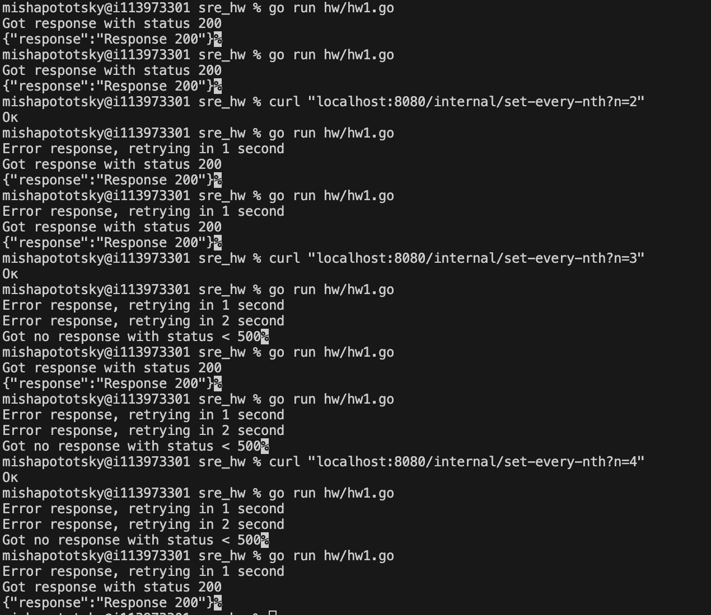

## Часть 1

У меня есть "внешняя" апишка с двумя ручками:

1) ручка target-handler, которую я вызываю для теста GetData. Она возвращает response 200 в ответ на каждый n-тый запрос (n задается переменной every_nth)

2) внутренняя ручка /internal/set-every-nth, которая проставляет значение every_nth = n (query параметр)

Для демонстрации работы GetData я вызывал ее для разных значений n. На скрине есть как случаи, в которых с первой или второй попытки был получен ответ, так и случаи, когда за три попытки ответ получен не был.

## Часть 2

Внешняя апишка не поменялась.
Функция GetDataWithCircuitBreaker вызывается из еще одной апишки (типа прокси). В функции логируются все переходы между статусами circuit breaker (только переход в статус half-open логируется не ровно через 10 секунд, а в момент первого запроса после прохождения 10 секунд).

Для того, чтобы показать работу функции, я периодически делал `curl localhost/call-get-data-with-circuit-breaker` и блокировал (`curl "localhost:8080/internal/set-every-nth?n=100"`) или открывал (curl "localhost:8080/internal/set-every-nth?n=1") внешнюю апишку.

Изначально апишка всегда отвечала двухсотками. Затем я ее заблокировал и в логах появлились ошибки и переходы в open и half-open. Затем я ее снова разблокировал и circuit breaker перешел в статус closed, а в логах опять появились двухсотки. Все эти этапы можно отследить по логам.

